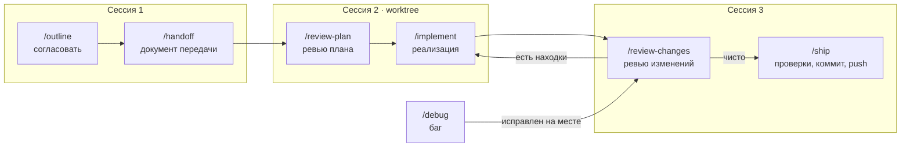

# Skills — процесс разработки с AI-агентом

Набор скилов для [Claude Code](https://docs.claude.com/en/docs/claude-code) и [Codex](https://github.com/openai/codex), который ведёт задачу от обсуждения до push: согласовать → спланировать → реализовать → проверить → отправить.

- **Решения за вами, работа за агентом.** Агент сам ищет факты в коде, решает очевидное и спрашивает только о дорогом, спорном и необоснуемом — пронумерованными вопросами с рекомендацией первой.
- **Второе мнение от двух агентов.** `/ask-agents` отдаёт любой промпт или скил (`/ask-agents /review-changes`) Codex и Claude параллельно; они до трёх раундов проверяют ответы друг друга, итог — список правок для `/implement`.
- **Сессии без потери контекста.** Разговор сжимается в документ передачи, и следующая сессия продолжает с него — без истории и лишнего контекста.
- **Ничего не уходит в git без спроса.** Коммит и push — только командой `/ship`.

## Быстрый старт

```bash
git clone git@github.com:ymatuhin/skills.git ~/.claude/skills
```

Если `~/.claude/skills` уже занят, склонируйте репозиторий в другое место и добавьте симлинки на нужные скилы в `~/.claude/skills`.

Для Codex — симлинки в `~/.codex/skills`:

```bash
~/.claude/skills/sync-links.sh
```

Дальше начните задачу в проекте:

```
/outline Добавить экспорт отчёта в CSV
```

### Что нужно

| Для чего                                        | Требуется                                   |
| ----------------------------------------------- | ------------------------------------------- |
| Основной процесс                                | Claude Code или Codex                       |
| Консультация двух агентов (`/ask-agents`)       | оба CLI — `claude` и `codex`, а также `jq`  |

`ask-agents/run.sh` перед первым раундом обновляет Claude командой `brew upgrade --cask claude-code@latest` (не дольше 2 минут). Сбой одного агента — сообщение одной строкой, итог собирается по ответившему.

## Как это работает



| Задача          | Маршрут                                                                                                    |
| --------------- | ---------------------------------------------------------------------------------------------------------- |
| Фича, изменение | `/outline` → `/handoff` → новая сессия (worktree): `/review-plan <путь>` → `/implement <путь>` → новая сессия: `/review-changes <путь>` → при находках `/implement <путь>` и снова ревью → `/ship <путь>` |
| Баг             | `/debug` → исправление на месте → `/review-changes` → `/ship`; крупное — `/handoff` → тот же хвост          |
| Второе мнение   | `/ask-agents /<скил> <аргументы>` или `/ask-agents <вопрос>` → при правках `/implement <путь к final.md>` |

Скилы связывает **каталог задачи** `/tmp/handoffs/<yyyy-mm-dd>-<slug>/`: в нём документ передачи `handoff.md` и тикеты; находки ревью — разделом «Находки ревью» в документе. Каждый скил работает и сам по себе — по аргументам и контексту разговора. Команду следующего шага скил выводит отдельным блоком, её можно скопировать.

### Как агент задаёт вопросы

Все скилы, где нужны решения пользователя, спрашивают в одном формате — по правилам `grilling`:

```md
**В1.** Куда класть сгенерированный CSV?

1. Отдавать файлом в ответе API, но большие отчёты держат соединение
2. Сохранять в хранилище и отдавать ссылку, но нужна очистка старых файлов

---

**Решено по умолчанию**

- Разделитель — запятая: так в существующем экспорте.
```

Ответ «Ок» или «+» принимает все рекомендации и решения по умолчанию; можно ответить только на часть вопросов, остальные примутся по рекомендации.

## Скилы

### Рабочий процесс

| Команда           | Что делает                                                                 | Меняет файлы                    |
| ----------------- | -------------------------------------------------------------------------- | ------------------------------- |
| `/outline`        | Согласует задачу раундами вопросов: цель, границы, решения                 | нет                             |
| `/handoff`        | Сжимает разговор в документ передачи для новой сессии                      | `handoff.md` в каталоге задачи  |
| `/to-tickets`     | Разбивает задачу на проверяемые тикеты с зависимостями                     | `tickets/` в каталоге задачи    |
| `/review-plan`    | Проверяет план против кода и правил проекта                                | документ плана                  |
| `/implement`      | Реализует задачу, проверяет затронутое, объясняет результат                | код, не коммитит                |
| `/review-changes` | Ревью незакоммиченных изменений по направлениям                            | «Находки ревью» в документе     |
| `/ship`           | Полные проверки, коммиты по смыслу, push                                   | git                             |
| `/debug`          | Воспроизводит баг, доказывает причину, исправляет через тест               | код                             |
| `/ask-agents`     | Консультация: Codex и Claude выполняют промпт или скил и проверяют друг друга | нет, итог — `final.md` в `/tmp` |
| `/retro`          | Разбирает сессию и предлагает улучшения инструкций и проверок              | нет                             |

### Вспомогательные

Их загружают скилы процесса; `tdd` и `show-me` можно вызвать и напрямую.

| Скил              | Роль                                                                             |
| ----------------- | -------------------------------------------------------------------------------- |
| `grilling`        | Формат и критерии вопросов: что агент решает сам, а что спрашивает               |
| `domain-modeling` | Сверяет термины с `GLOSSARY.md` и кодом, формулирует записи словаря и ADR        |
| `spec-writing`    | Записывает принятые продуктовые решения в `SPEC.md`                              |
| `tdd`             | Цикл «падающий тест → минимальный код → успешный тест»                           |
| `show-me`         | Объясняет изменения визуально: схема, дерево вызовов, Mermaid, эскиз кода        |

### Сторонние

`frontend-design` (дизайн интерфейсов) и `teach` (обучение теме за несколько сессий) к маршруту не относятся.

## Подробнее о каждом скиле

<details>
<summary><code>/outline</code> — согласование задачи</summary>

Ничего не меняет и файлов не создаёт: раунды вопросов через `grilling` — В1, В2… с рекомендацией первой; «Ок/+» принимает рекомендации и решения по умолчанию. Итога не выводит; когда открытых вопросов нет — предлагает `/handoff` или `/implement`.

</details>

<details>
<summary><code>/debug</code> — диагностика бага</summary>

Уточняет симптом, воспроизводит минимально, проверяет гипотезы по одной с предсказанием и доказательством, исправляет через `tdd`; решения об исправлении — по правилам `grilling`. В конце удаляет исследовательские правки.

</details>

<details>
<summary><code>/handoff</code> — документ передачи</summary>

Сжимает разговор в `/tmp/handoffs/<yyyy-mm-dd>-<slug>/handoff.md`; в том же каталоге хранятся тикеты. Выводит команды `/review-plan <путь>` и `/implement <путь>`.

</details>

<details>
<summary><code>/to-tickets</code> — разбиение на тикеты</summary>

Сохраняет задачи реализации с критериями приёмки и зависимостями отдельными файлами в `tickets/` каталога задачи. Общие решения остаются в исходном документе.

</details>

<details>
<summary><code>/review-plan</code> — ревью плана</summary>

Проверяет план из разговора или документа: факты против кода, полнота, правила проекта, границы, проверяемость, имена (соглашения, занятость, точность, согласованность). Обоснованное правит в документе сам, спорное спрашивает; код не трогает. Когда открытых вопросов нет — предлагает `/implement <путь>`; без документа — `/implement`.

</details>

<details>
<summary><code>/implement</code> — реализация</summary>

Выполняет задачу в текущем дереве; решения вне документа, отклонения от плана и пограничные случаи — по правилам `grilling`; использует `tdd` при изменении поведения, проверяет точечно затронутые файлы. Отмечает шаги в документе, без документа — в итоговом сообщении. Исправляет пункты «ожидает» из «Находок ревью» документа или из `final.md` `/ask-agents`. Ответ начинает с объяснения по `show-me`, как работает затронутая часть системы и что изменилось. Не коммитит.

</details>

<details>
<summary><code>/review-changes</code> — ревью изменений</summary>

Проверяет изменения по направлениям: корректность, правила и спека, читаемость, границы, устойчивость, тесты, безопасность. Код не правит: находки — по правилам `grilling`, принятые записывает в документ разделом «Находки ревью» со статусом «ожидает»; при повторном ревью сверяет старые пункты с кодом. Дальше — `/implement` для исправлений и повторное ревью, без находок — `/ship`.

</details>

<details>
<summary><code>/ship</code> — отправка</summary>

Только по явному запросу: полные проверки один раз, коммиты только с изменениями задачи, push в текущую ветку; на основную ветку не пушит — спрашивает.

</details>

<details>
<summary><code>/ask-agents</code> — консультация у двух агентов</summary>

Отдаёт один промпт Codex (`codex exec`) и Claude (`claude -p`) параллельно через `ask-agents/run.sh`: каждый в своей модели по умолчанию с high effort, read-only, без MCP и плагинов. Команду скила в начале промпта скрипт передаёт Codex как `$скил`, Claude — как `/скил`, поэтому любой скил можно спросить у двух агентов: `/ask-agents /review-changes <путь>`, `/ask-agents /review-plan <путь>`. Сами скилы об `ask-agents` не знают: режим консультации и формат отчёта (`ROUND-1.md`) скрипт добавляет к промпту.

Раунды: 1 — независимые отчёты (ID `CL-N` у Claude, `CX-N` у Codex); 2 — каждый проверяет отчёт другого (`run.sh --cross`, `CROSS.md`); 3 — ответы на опровержения. Четвёртого нет: оставшиеся споры ведущая сессия решает по коду или выносит вопросом по правилам `grilling`. Итог — `final.md` в каталоге прогона с пометками «Claude» / «Codex» / «оба». Сам `/ask-agents` ничего не меняет: пункты «ожидает» исправляет `/implement <путь к final.md>`. Прогон агента ограничен 20 минутами (`ASK_AGENTS_TIMEOUT`).

</details>

<details>
<summary><code>/retro</code> — разбор сессии</summary>

Разбирает текущую или указанную сессию: предлагает подтверждённые улучшения навигации, проверок, инструкций и работы с инструментами; файлы не меняет.

</details>

## Постоянные документы проекта

Скилы ведут в репозитории проекта три вида документов:

| Документ      | Назначение                                                  | Кто формулирует                                                       | Формат                              |
| ------------- | ----------------------------------------------------------- | --------------------------------------------------------------------- | ----------------------------------- |
| `GLOSSARY.md` | термины домена                                              | `domain-modeling` в раундах `/outline`; в `/review-changes` — как исправление | запись в `domain-modeling/SKILL.md` |
| `docs/adr/`   | причины неочевидных решений; только с согласия пользователя | `domain-modeling` в раундах `/outline` и `/review-changes`, вопросом В-N      | `domain-modeling/ADR-FORMAT.md`     |
| `SPEC.md`     | принятые продуктовые решения проверяемыми утверждениями     | `spec-writing` в раундах `/outline`                                   | шаблон в `spec-writing/SKILL.md`    |

Записи в эти документы попадают в репозиторий не сразу: `/outline` предлагает их внутри раунда вопросов, `/handoff` переносит дословно, вносит — `/implement`.

## Как устроены связи между скилами

`grilling`, `domain-modeling` и `spec-writing` не вызываются пользователем и друг о друге не знают: каждый описывает только своё поведение, связывает их вызывающий скил.

| Скил              | Загружают                                                                                     |
| ----------------- | --------------------------------------------------------------------------------------------- |
| `grilling`        | `/outline`, `/review-plan`, `/implement`, `/review-changes`, `/debug`, `/ship`, `/to-tickets`, `/ask-agents`, `tdd` |
| `domain-modeling` | `/outline`, `/review-changes`                                                                 |
| `spec-writing`    | `/outline`                                                                                    |
| `tdd`             | `/implement` при изменении поведения, `/debug` для исправления                                |
| `show-me`         | `/implement` в итоговом сообщении                                                             |

- `grilling` — формат и критерии вопросов: В-N, «Ок/+», «Решено по умолчанию»; факты ищет агент; обоснованное и дешёвое решает сам и показывает списком, дорогое, необоснуемое и конфликтующее с принятым спрашивает.
- `domain-modeling` и `spec-writing` сами по себе пишут файлы; `/outline` загружает их и переводит записи в раунды `grilling`. `/review-changes` загружает `domain-modeling` и выдаёт записи как находки — вопросом В-N или строкой «Решено по умолчанию» с файлом, действием, якорем и итоговым текстом.
- `tdd` швы вне задачи согласует через `grilling`.

## Структура репозитория

```
<скил>/
  SKILL.md            # инструкция: frontmatter name, description + текст
  agents/openai.yaml  # настройка для Codex
  *.md                # форматы и справочники, на которые ссылается SKILL.md
sync-links.sh         # симлинки ~/.codex/skills → ~/.claude/skills
```

- `agents/openai.yaml` — `allow_implicit_invocation: false`: Codex запускает скил только явной командой.
- `sync-links.sh` — источник скилов один, `~/.claude/skills`. Скрипт идемпотентен: досоздаёт недостающие симлинки, удаляет битые, сообщает о файлах, которые есть только в Codex. Запускайте после добавления или удаления скила.
- `.trash/` и `.DS_Store` в `.gitignore`.

## Благодарности

- Скилы рабочего процесса адаптированы на основе набора [Matt Pocock — mattpocock/skills](https://github.com/mattpocock/skills). Названия, форматы документов и инструкции изменены под местный процесс; атрибуция относится ко всему этому набору, а не только к `retro` и `to-tickets`. Последние добавлены по [версии 1.3.1](https://github.com/mattpocock/skills/tree/v1.3.1/skills/engineering).
- `show-me` — сокращённая русская адаптация скилла [HumanLayer show-me](https://github.com/humanlayer/skills/blob/main/plugins/show-me/skills/show-me/SKILL.md).
- `frontend-design` распространяется по Apache License 2.0 — см. `frontend-design/LICENSE.txt`.
